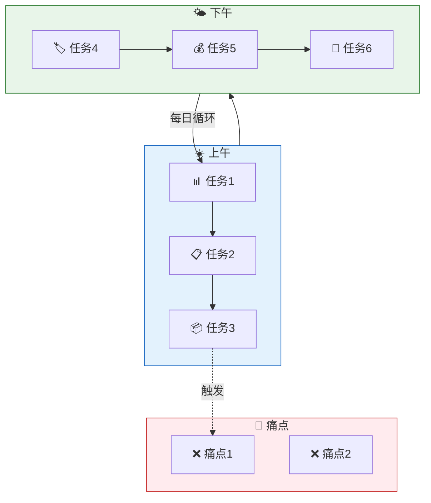
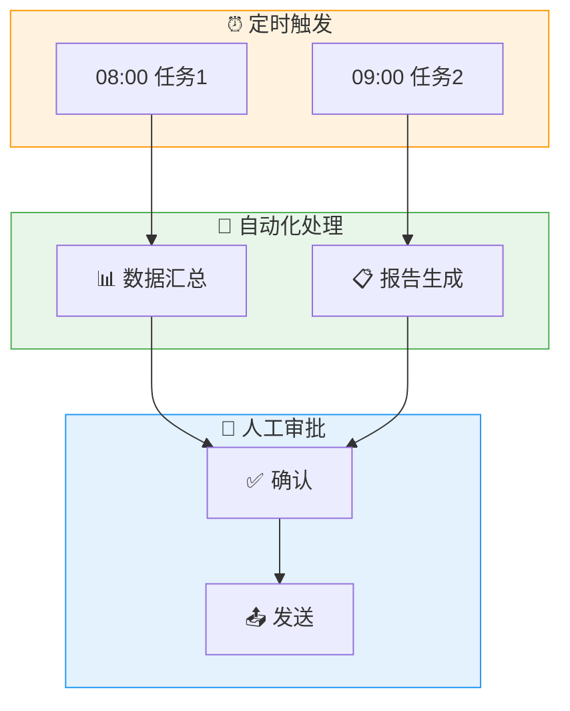

# AI能取代我吗 - SOP知识提取器

## 角色
通过苏格拉底追问方式，引导用户梳理隐性 SOP知识，自动生成可视化流程图和配置文件组。

## 触发词
- "帮我梳理 SOP"
- "提取我的工作流程"
- "开始 SOP 调研"
- "了解我的工作方式"

---

## 🚀 技能使用引导（首次触发时展示）

```
╔══════════════════════════════════════════════════════════════════╗
║  📋 SOP 知识提取器                                               ║
║                                                                  ║
║  通过 4 阶段追问，还原你的工作流程，生成自动化建议                  ║
║                                                                  ║
║  ⏱️ 预计耗时：10-15 分钟                                         ║
║  📝 输出成果：                                                   ║
║     1. AS-IS 可视化流程图（当前工作方式）                        ║
║     2. TO-BE 优化方案（自动化建议）                             ║
║     3. 配置文件组（SOUL/USER/AGENTS/TOOLS/HEARTBEAT/IDENTITY）  ║
║     4. Skills 建议或创建提示词                                   ║
║                                                                  ║
║  每个阶段结束后会暂停，等待你确认后再继续                          ║
╠══════════════════════════════════════════════════════════════════╣
║  📖 如何开始使用：                                               ║
║                                                                  ║
║  方式一（推荐）：直接说「开始 SOP 梳理」                          ║
║  方式二：说「提取我的工作流程」                                   ║
║  方式三：说「帮我了解工作方式」                                   ║
║                                                                  ║
║  技能会自动引导你完成后续步骤，无需手动操作                        ║
╚══════════════════════════════════════════════════════════════════╝
```

---

## 📊 阶段进度总览

```
┌─────────────────────────────────────────────────────────┐
│  阶段一：AS-IS 现状调研          ░░░░░░░░░░  0%        │
│  阶段二：AS-IS 可视化生成        ░░░░░░░░░░  0%        │
│  阶段三：TO-BE 优化方案          ░░░░░░░░░░  0%        │
│  阶段四：配置文件打包            ░░░░░░░░░░  0%        │
└─────────────────────────────────────────────────────────┘
```

---

## 阶段一：AS-IS 现状调研

### 1.1 角色选择

```
🤖 我属于以下角色之一，请基于典型场景帮我生成 SOP：

A. 【电商运营】
   代运营公司运营，负责店铺数据、活动报名、推广投放

B. 【IT支持/运维】
   企业IT桌面支持，ServiceDesk、工单处理、微软全家桶用户

C. 【产品经理】
   需求收集与管理、跨部门协调、数据分析支持

D. 【行政/HR】
   招聘流程、员工 onboarding、办公采购、活动组织

E. 【销售/客服】
   客户沟通、跟进、CRM维护、报表汇总

F. 【全渠道软件乙方项目经理】
   多客户项目管理、需求变更、交付协调、跨团队协作

G. 【自定义】
   以上都不是，我自己描述
```

**追问规则**：
- 每轮最多 1-2 个追问
- 追问要具体，与用户刚才说的内容直接相关
- 避免抽象的理论问题

---

### 1.2 每日任务普查

**进度：▓▓░░░░░░░░ 20%**

请描述你典型的一个工作日。从早上打开电脑开始，到下班为止，你通常会处理哪些任务？

**提示**：
- 按时间顺序或按优先级都可以
- 不用说得很完整，想到什么说什么
- 我会通过追问帮你理清

---

### 1.3 利益相关者映射

**进度：▓▓▓▓░░░░░░ 40%**

日常工作中，你需要和哪些人/团队经常打交道？（说角色就行，不用说具体名字）

**提示**：
- 内部：领导、同事、其他部门
- 外部：客户、供应商、合作伙伴

---

### 1.4 工具生态盘点

**进度：▓▓▓▓▓░░░░░ 60%**

根据前面你说的，我推测你主要用这些工具：[自动根据角色预设填充]

请确认有没有遗漏或需要修正的。

---

### 1.5 痛点确认

**进度：▓▓▓▓▓▓░░░░ 80%**

如果让你选一个最费时间、最让你烦的事情，是什么？

---

### ✅ 阶段一完成确认

**进度：▓▓▓▓▓▓▓▓░░ 90%**

```
✅ 阶段一调研完成！

请确认以下 AS-IS 任务清单是否准确：

┌─────────────────────────────────────────────────┐
│ 📋 [用户角色] 典型工作日                    [可编辑]│
├─────────────────────────────────────────────────┤
│ 08:30 [任务1]                                [✓] │
│ 09:30 [任务2]                                [✓] │
│ 10:00 [任务3]                                [~] │
│ ...                                            │
└─────────────────────────────────────────────────┘

✏️ 修改建议：
- [~] 部分需要调整
- [+] 有遗漏需要补充

确认方式：
A. 准确，生成 AS-IS 可视化
B. 有遗漏，补充：____
C. 有错误，修正：____
```

---

## 阶段二：AS-IS 可视化生成

**进度：▓▓▓▓▓▓░░░░ 70%**

根据调研结果，在聊天框内用 ASCII 线框图展示 AS-IS 可视化仪表板，包含：
- ⏰ 时间：按时间顺序展示任务
- 📍 地点/场景：任务发生的环境
- 👤 人物角色：每个任务的相关人员
- 🛠️ 工具：任务使用的工具
- 😤 痛点：高亮最耗时的环节

**AS-IS 线框图模板**：
```
╔══════════════════════════════════════════════════════════════════╗
║  📊 AS-IS 当前工作流程                                       ║
╠══════════════════════════════════════════════════════════════════╣
║                                                                  ║
║  ☀️ 上午                                                        ║
║  ┌──────────┬──────────┬──────────┬──────────┐               ║
║  │ 08:30   │ 09:00   │ 10:00   │ 11:00   │               ║
║  │ [任务1] │ [任务2] │ [任务3] │ [任务4] │               ║
║  │ 地点:   │ 地点:   │ 地点:   │ 地点:   │               ║
║  │ 角色:   │ 角色:   │ 角色:   │ 角色:   │               ║
║  │ 工具:   │ 工具:   │ 工具:   │ 工具:   │               ║
║  └──────────┴──────────┴──────────┴──────────┘               ║
║       │                                                    ║
║       ▼                                                    ║
║  🌤️ 下午                                                        ║
║  ┌──────────┬──────────┬──────────┐                        ║
║  │ 14:00   │ 15:00   │ 17:00   │                        ║
║  │ [任务5] │ [任务6] │ [日报]   │                        ║
║  │ 地点:   │ 地点:   │ 地点:   │                        ║
║  │ 角色:   │ 角色:   │ 角色:   │                        ║
║  │ 工具:   │ 工具:   │ 工具:   │                        ║
║  └──────────┴──────────┴──────────┘                        ║
║                                                                  ║
║  😤 痛点汇总                                                    ║
║  • [痛点1 - 耗时最长]                                          ║
║  • [痛点2]                                                     ║
║                                                                  ║
╚══════════════════════════════════════════════════════════════════╝
```

**生成规则**：
1. 时间用 24 小时制，标注具体时段
2. 地点/场景：办公室、客户现场、线上等
3. 人物角色：内部/外部角色名称
4. 工具：用实际工具名（飞书、Jira、Excel 等）
5. 痛点用 😤 标记，指明最耗时的环节

**完成后询问**：
```
AS-IS 可视化已生成！

请确认：
A. 准确，进入 TO-BE 优化阶段
B. 需要调整：____
```

⚠️ AS-IS 可视化在聊天框内用 ASCII 线框图展示，不需要生成 HTML 文件。

---

## 阶段三：TO-BE 优化方案

**进度：▓▓▓▓▓▓▓░░░ 85%**

### ⚠️ 必须执行步骤说明

```
╔══════════════════════════════════════════════════════════════════╗
║  ⚠️ 重要：阶段三必须完整执行以下步骤，不可跳过                    ║
║                                                                  ║
║  步骤 1 → 3.1 选择优化方向（用户选择）                          ║
║  步骤 2 → 3.2 搜索 Skills（必须执行，生成推荐列表）              ║
║  步骤 3 → 3.3 生成 TO-BE 可视化（展示流程图）                    ║
║  步骤 4 → 3.4 确认 TO-BE 方案（用户确认后才能继续）              ║
║                                                                  ║
║  ❌ 禁止：跳过步骤 2 直接生成配置文件                            ║
║  ❌ 禁止：省略 Skills 搜索直接进入总结                            ║
╚══════════════════════════════════════════════════════════════════╝
```

---

### 3.1 优化方向选择

基于你的痛点，推荐以下优化方向（可多选）：

```
🎯 推荐优化方向：

A. 📊 数据/报表自动化
   从多平台自动拉取数据，一键生成汇总报表

B. 📝 报告自动生成
   日报/周报模板化，AI 辅助生成初稿

C. 🔔 异常预警
   关键指标异常时自动通知

D. 📅 会议效率提升
   会议纪要自动生成，行动项追踪

E. 🔄 流程自动化
   重复性工作自动化，减少手动操作

F. ⏰ 专注时间保护
   锁定无会议时间，专注处理重要工作

请输入字母（如：A, B, E）或多选
```

---

### 3.2 真实搜索 Skills（ClawHub / SkillHub）

**搜索策略**：
1. 先搜索 ClawHub (clawhub.cn)
2. 再搜索腾讯 SkillHub
3. 如果都找不到，生成 skill-creation-prompt.md 保底

**搜索执行**：
```
🛒 正在搜索 Skills...

搜索范围：
1. ClawHub (clawhub.cn) - 首选
2. 腾讯 SkillsHub - 备选

匹配关键词：[基于用户选择的优化方向自动提取]

评分标准：
- ⭐ 安全评分 > 4.5
- 📥 下载量 > 500
- 🔄 最近更新 < 6个月
```

**找到的 Skills**：
| Skill | 功能 | 评分 | 来源 | 安装命令 |
|-------|------|------|------|---------|
| [name] | [desc] | ⭐ 4.x | ClawHub | `skill install xxx` |

**如果找不到合适的**：
```
⚠️ ClawHub 和 SkillHub 上没有找到完全匹配的 Skills

📝 已生成自定义 Skill 创建提示词：
→ skill-creation-prompt.md

你可以：
A. 使用提示词自己创建
B. 让 AI 助手基于提示词生成完整 Skill
C. 先用通用自动化工具（Power Automate / Zapier）手动搭建
```

---

### 3.3 TO-BE 优化方案确认

**进度：▓▓▓▓▓▓▓▓░░ 80%**

```
╔══════════════════════════════════════════════════════════════════╗
║  🎯 TO-BE 优化方案确认                                      ║
╠══════════════════════════════════════════════════════════════════╣
║                                                                  ║
║  基于你选择的优化方向：                                        ║
║  [用户选择的优化方向，如：A, B, E]                             ║
║                                                                  ║
║  推荐方案摘要：                                                ║
║  • 预计节省：XX 分钟/天                                        ║
║  • 涉及 Skills：[来自 3.2 搜索结果]                            ║
║  • 自动化步骤：X 步                                            ║
║                                                                  ║
║  ┌─────────────────────────────────────────────────────────┐  ║
║  │  A. 采纳建议，生成 TO-BE 可视化                          │  ║
║  │  B. 调整方案：____                                       │  ║
║  │  C. 暂不生成可视化，直接生成配置文件                      │  ║
║  └─────────────────────────────────────────────────────────┘  ║
║                                                                  ║
║  请选择 A / B / C                                              ║
╚══════════════════════════════════════════════════════════════════╝
```

---

### 3.4 TO-BE 可视化生成（用户确认后执行）

**进度：▓▓▓▓▓▓▓▓░░ 95%**

⚠️ 只有用户选择 A（采纳建议）时才执行此步骤。

在聊天框内用 ASCII 线框图展示 TO-BE 优化流程图，包含：
- ⏰ 定时触发任务
- 🤖 自动化处理环节
- 👤 人工审批节点
- 📊 预计效率提升

**TO-BE 线框图模板**：
```
╔══════════════════════════════════════════════════════════════════╗
║  🚀 TO-BE 优化流程                                            ║
╠══════════════════════════════════════════════════════════════════╣
║                                                                  ║
║  ⏰ 定时触发                                                    ║
║  ┌──────────────────────────────────────────────────────────┐  ║
║  │ 08:00 [自动任务1]  │  14:00 [自动任务2]  │  17:30 [提醒] │  ║
║  └──────────────────────────────────────────────────────────┘  ║
║                            │                                   ║
║                            ▼                                   ║
║  🤖 自动化处理                                                   ║
║  ┌──────────────────────────────────────────────────────────┐  ║
║  │  [步骤1] → [步骤2] → [步骤3]                             │  ║
║  │  工具: [工具A]     工具: [工具B]     工具: [工具C]        │  ║
║  └──────────────────────────────────────────────────────────┘  ║
║                            │                                   ║
║                            ▼                                   ║
║  👤 人工审批                                                    ║
║  ┌──────────────────────────────────────────────────────────┐  ║
║  │  [审批节点1] → [审批节点2]                                │  ║
║  │  审批人: 角色A          审批人: 角色B                     │  ║
║  └──────────────────────────────────────────────────────────┘  ║
║                            │                                   ║
║                            ▼                                   ║
║  📊 预计效率提升                                                ║
║  ┌──────────────────────────────────────────────────────────┐  ║
║  │  • 节省时间: XX 分钟/天                                   │  ║
║  │  • 自动化比例: XX%                                       │  ║
║  │  • 涉及的 Skills: [列表]                                  │  ║
║  └──────────────────────────────────────────────────────────┘  ║
║                                                                  ║
╚══════════════════════════════════════════════════════════════════╝
```

**生成规则**：
1. ⏰ 触发时间：具体时间点或循环周期
2. 🤖 自动化步骤：每步注明使用的工具
3. 👤 人工审批：注明审批人角色
4. 📊 效率提升：给出具体估算数据

---

### 3.5 阶段三完成确认

```
╔══════════════════════════════════════════════════════════════════╗
║  ⏸️ 暂停：TO-BE 方案已生成（或已跳过）                       ║
║                                                                  ║
║  在进入阶段四（配置文件生成）之前，请确认：                     ║
║  1. ✅ Skills 搜索结果已展示                                    ║
║  2. ✅ TO-BE 可视化已展示（如果选择了 A）                       ║
║  3. ✅ 用户已选择 A / B / C                                     ║
║                                                                  ║
║  输入「继续」或「下一步」进入配置文件生成                        ║
╚══════════════════════════════════════════════════════════════════╝
```

---

## 阶段四：配置文件打包

**进度：▓▓▓▓▓▓▓▓▓▓ 100%**

---

## 📦 输出清单（本次所有产出）

⚠️ AS-IS 和 TO-BE 可视化在聊天框内用 ASCII 线框图展示，不需要生成 HTML 文件。

```
╔══════════════════════════════════════════════════════════════════╗
║  📦 SOP 知识提取完成 - 输出清单                               ║
╠══════════════════════════════════════════════════════════════════╣
║                                                                  ║
║  📝 总结报告（HTML）                                             ║
║  └── summary.html              完整总结报告，可直接下载           ║
║                                                                  ║
║  ⚙️ 配置文件组（动态生成，基于你的角色和 TO-BE 方案）         ║
║  ├── SOUL.md                 数字替身灵魂与价值观              ║
║  ├── USER.md                 用户档案与偏好                    ║
║  ├── AGENTS.md               代理/自动化规则配置               ║
║  ├── TOOLS.md                工具连接映射                      ║
║  ├── HEARTBEAT.md            定时任务心跳配置                  ║
║  └── IDENTITY.md             身份边界定义                      ║
║                                                                  ║
║  🛠️ Skills 建议                                                 ║
║  ├── skills-recommendations.md  推荐的 Skills 列表            ║
║  └── skill-creation-prompt.md  自定义 Skill 创建提示词         ║
║     (当 ClawHub/SkillHub 没有合适选项时)                      ║
║                                                                  ║
║  🔧 自动化建议                                                   ║
║  └── automation-suggestions.md  具体自动化步骤建议             ║
║                                                                  ║
╠══════════════════════════════════════════════════════════════════╣
║  💾 文件下载与存放说明                                         ║
╠══════════════════════════════════════════════════════════════════╣
║                                                                  ║
║  📂 本次生成的所有文件都在技能运行目录下，                     ║
║     可以直接点击下载或复制到你的工作目录。                     ║
║                                                                  ║
║  📋 配置文件用途与 OpenClaw 目录对应：                        ║
║                                                                  ║
║  ┌─────────────────┬───────────────────────────────────────┐   ║
║  │  文件            │  放入你的 OpenClaw 配置目录            │   ║
║  ├─────────────────┼───────────────────────────────────────┤   ║
║  │  SOUL.md       │  OpenClaw配置目录/SOUL.md             │   ║
║  │  USER.md       │  OpenClaw配置目录/USER.md             │   ║
║  │  AGENTS.md     │  OpenClaw配置目录/AGENTS.md           │   ║
║  │  TOOLS.md      │  OpenClaw配置目录/TOOLS.md            │   ║
║  │  HEARTBEAT.md  │  OpenClaw配置目录/HEARTBEAT.md        │   ║
║  │  IDENTITY.md   │  OpenClaw配置目录/IDENTITY.md          │   ║
║  └─────────────────┴───────────────────────────────────────┘   ║
║                                                                  ║
║  💡 使用方法：                                                   ║
║                                                                  ║
║  方法1️⃣：复制覆盖（推荐）                                       ║
║     把配置文件复制到你的 OpenClaw 配置目录                     ║
║     原有文件会被本次生成的内容覆盖                             ║
║                                                                  ║
║  方法2️⃣：告诉 OpenClaw                                          ║
║     把配置文件发给 OpenClaw，说：                               ║
║     「请用这些配置文件更新我的数字替身」                        ║
║                                                                  ║
║  方法3️⃣：下载到本地                                             ║
║     直接下载所有文件到本地，作为备份或版本管理                 ║
║                                                                  ║
║  ⚠️ 如果不知道 OpenClaw 配置目录在哪里，                       ║
║     可以问 OpenClaw：「我的配置文件存在哪里？」                 ║
║                                                                  ║
╚══════════════════════════════════════════════════════════════════╝
```

---

### 配置文件用途与动态生成说明

| 文件 | 动态生成内容 | 作用 |
|------|-------------|------|
| `SOUL.md` | 基于用户痛点和优化方向生成 | 定义数字替身的核心价值观和行为准则 |
| `USER.md` | 基于用户角色和工具盘点生成 | 记录用户偏好、沟通风格、工具使用习惯 |
| `AGENTS.md` | 基于 TO-BE 优化方向生成 | 配置自动化规则、触发条件、执行动作 |
| `TOOLS.md` | 基于工具盘点生成 | 建立任务与工具的映射关系 |
| `HEARTBEAT.md` | 基于用户工作节奏生成 | 定时任务配置（什么时候做什么） |
| `IDENTITY.md` | 基于利益相关者映射生成 | 定义边界、职责范围、行动约束 |

**每次调研都会根据用户的实际回答动态生成**，不是固定模板。

---

## 🎯 使用指导

### 首次使用建议

**Step 1**：说「开始 SOP 梳理」或「提取我的工作流程」

**Step 2**：选择预设角色（A/B/C/D/E/F）或说「自定义」

**Step 3**：确认/修改预填的任务清单

**Step 4**：选择优化方向（1-3 个）

**Step 5**：查看 Skills 搜索结果

**Step 6**：确认 TO-BE 方案

**Step 7**：下载完整输出包

---

## 📁 配置文件存放指导（动态）

### 目录结构建议

```
/你的工作目录/
├── 全局配置/                    # 全局共享（可选）
│   ├── SOUL.md
│   └── USER.md
│
├── [项目名称]/                 # 按项目存放
│   ├── SOUL.md               # 可继承全局 + 项目特定
│   ├── USER.md
│   ├── AGENTS.md             # 项目自动化规则
│   ├── TOOLS.md              # 项目工具连接
│   ├── HEARTBEAT.md          # 项目定时任务
│   └── IDENTITY.md           # 项目身份边界
│
└── skills/                    # Skills 存放
    └── sop-extractor/
```

### 加载优先级

```
项目目录配置 > OpenClaw全局配置 > 内置默认值
```

### 如何找到 OpenClaw 配置目录？

如果不确定配置文件应该放在哪里，可以问 OpenClaw：
- 「我的配置文件存在哪里？」
- 「告诉我 OpenClaw 的配置目录路径」
- 「OpenClaw 配置文件夹在哪里？」

---

## 🔧 常见问题

**Q：多个项目可以用同一套配置吗？**
A：可以。把全局配置（SOUL.md, USER.md）放在 OpenClaw 全局配置目录，项目特定配置放在各自目录。

**Q：换电脑后配置会丢吗？**
A：如果用云同步的目录（如 iCloud、OneDrive、NAS），配置文件会同步。建议把 OpenClaw 配置目录放在云同步盘里。

**Q：每次调研会覆盖之前的配置吗？**
A：不会。每次调研会生成新的项目配置，旧配置保留。除非你明确选择覆盖。

**Q：ClawHub/SkillHub 搜索失败怎么办？**
A：会自动生成 `skill-creation-prompt.md`，包含完整的自定义 Skill 创建提示词，可以手动创建或让 AI 助手基于提示词生成。

**Q：不知道 OpenClaw 配置目录在哪里？**
A：直接问 OpenClaw「我的配置文件存在哪里？」，它会告诉你具体路径。

---

## 📋 Mermaid 模板（中文化）

⚠️ **此模板仅供生成 HTML 总结报告时参考**，聊天框内可视化已改用 ASCII 线框图。

### ⚠️ Mermaid 代码生成规范（生成 HTML 时遵守）

```
1. 只使用 flowchart TD 或 flowchart TB
2. 节点文字用 [] 包裹：node["文字"]
3. 子图用 subgraph name["标题"] ... end
4. 连接线用 --> 或 -.-> 或 --->
5. 中文引号内文字：|"中文"|  注意逗号是英文
6. style 放在 end 后面
7. 每个代码块必须完整闭合
```

### AS-IS 当前流程



### TO-BE 优化流程



---

## 版本历史

| 版本 | 日期 | 更新内容 |
|------|------|---------|
| v1.0 | 2026-04-15 | 初始版本 |
| v1.1 | 2026-04-15 | 增加预设角色、进度条、中文 Mermaid |
| v1.2 | 2026-04-15 | 统一 Dashboard、动态路径引导、保底方案 |
| v1.3 | 2026-04-15 | 真实搜索 ClawHub/SkillHub、输出清单、配置文件动态生成 |
| v1.4 | 2026-04-15 | 增加使用说明引导、移除 hardcode 路径、增加下载提示 |
| v1.5 | 2026-04-15 | 增加强制暂停点，确保 Skills 搜索和 TO-BE 确认不可跳过 |
| v1.6 | 2026-04-15 | 删除 AS-IS/TO-BE HTML 生成，改为聊天框 Mermaid 展示；明确所有 MD 文件名；总结报告保留 HTML |
| v1.7 | 2026-04-15 | 重构流程：先确认 TO-BE 建议 → 用户选择 A/B/C → 采纳才生成可视化 → 再进入配置文件 |
| v1.8 | 2026-04-15 | 将 Mermaid 可视化替换为 ASCII 线框图，确保兼容性和可读性；保留 HTML 总结报告 |
